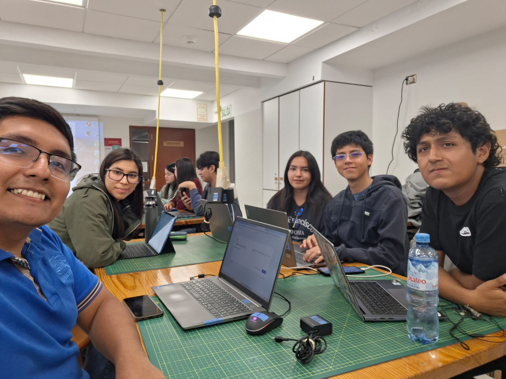

# Proyecto de Biodiseño 1
**

¡Bienvenidos al repositorio del grupo 12 de Proyectos de Biodiseño 1!**

# Conoce a nuestro equipo

 
 
| Cargo | Apellidos y nombres | 
|-------|---------------------|
| Modelador en 3D | Angie Xiomara Huánuco Vásquez |
| Electrónica | Angel Gabriel Morales Mayanga |
| Programador | Carlos Andres Ramos Guzmán |
| Investigación y Redacción| Aniball Harnaldo Panta Navarro |
| Gestor de Repositorio de GitHub | Micaela de Fátima Tassara Camarena  |

  

